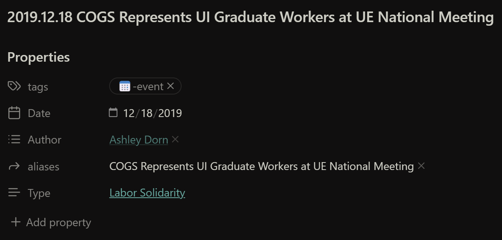

---
Author:
  - "[Jay Smuszkiewicz](../Categories/Members/Officers/Jay%20Smuszkiewicz.md)"
tags:
  - 💎-How-to
---

Hello! Welcome to the COGS-Obsidian Vault!

This is a project that I, [Jay Smuszkiewicz](../Categories/Members/Officers/Jay%20Smuszkiewicz.md), worked on to help fix the COGS website. 

This manual will guide you through how Obsidian works and what I have set-up here.

---

# Philosophy of Obsidian:

Obsidian is a free to use program that utilizes Markdown, a way to format text without any coding. It's a notes app that allows a ton of customization which I have here.

Obsidian is a program that does not need the internet and stays on your local device.

> [!warning]- Caveat: Needs the Internet to Sync
> - In order to sync among different computers, Obsidian does need to be connected to the Internet.
> - But if you don't have internet right now, that's okay. Any changes you make while in the vault will be synced once you re-connect.

# Why Obsidian and not the WordPress site?

A main reason why I am using Obsidian instead of a bunch of spreadsheets for digitizing data is because spreadsheets are static and it is hard to connect data. Plus, with spreadsheets you tend to see everything at once which can be overwhelming. With Obsidian, you can just open one note which allows to focus on the information you want to see. Something I love about Obsidian is the ability to link information together. You can think of Obsidian links as like hyperlinks that take you from one website to another. You can use links to go from one part of the vault to the next.

Here is a summary of differences between Spreadsheets and Obsidian:

| Spreadsheets                              | Obsidian                                     |
| ----------------------------------------- | -------------------------------------------- |
| Static                                    | Dynamic                                      |
| See everything at once                    | Can focus one piece of information at a time |
| Not fully customizable                    | Fully customizable if you know some code     |
| Information can't be linked to each other | Information can be linked together           |

# How to navigate the Obsidian vault:

See the below PDF for how to navigate what you see when you first open the vault. 

> [!note]-  
> I made this for a different vault but the information is still good.

# Plug-ins:

Plug-ins are a huge part of Obsidian and how this vault works. So, it is essential to understand how they work.

> [!attention]-
> - I originally made this for a different vault of mine.
> - The Relay plugin I talk about in this video is not used in this vault. But, this video still shows you how plug-ins are generally used.

# Linking:

- Understanding how to links notes to one another is a very important thing.
- The way linking is done is to enter  once you do that, you will see a menu pop up. As you type inside the brackets, Obsidian will try to find a note name with something similar.
- Link example:
	- [COGS Homepage](../COGS%20Homepage.md)

## Aliases:

- Something I LOVE about Obsidian is that notes can have more than 1 name. These are called Aliases. Let's take the [2019.12.18 COGS Represents UI Graduate Workers at UE National Meeting](../Categories/Events/2019.12.18%20COGS%20Represents%20UI%20Graduate%20Workers%20at%20UE%20National%20Meeting.md) note as an example.

In Obsidian, you can give notes different [Properties](./Properties.md), which adds metadata (data about the note) to the note. In this case, I have added aliases to the COGS Represents UI Graduate Workers at UE National Meeting note.

So, when I want to make a link to this note, as I type that in, I will see the options for the actual title and its aliases. To keep the organization clear, I thought adding the dates in a version that can keep notes sorted through the years, YYYY.MM.DD, would be good but I didn't like seeing them in [All Events](../../Events/All%20Events.md). So, instead, I display the alias. 

# Callouts:

Callouts are ways to add some color and some easily collapsible text to break up the note you are working in.

You've already seen a few of them in this note.

Example:
> [!info]- This is a callout!
> - Fun fact: Did you know that bald eagles only get their white heads after they are 5 years old?

This callout is collapsed by default. If you click on the > after "This is a callout!" the callout will expand so you can see the rest of the text. Can you see the fun fact?

You can click on the arrow again to collapse it.

I love callouts because I think they are good ways to group information together.

# Commands and Hotkeys:

Commands are things you can tell Obsidian to do.  
Hotkeys are keyboard shortcuts you can use to look up commands.

In the ribbon on the side, if you click on the icon that looks like >\_, you will open the command bar.

> [!tip]- Where is the Command Bar icon on the ribbon?  
> 

> [!tldr]- What the Command Bar looks like:  

You can scroll through the command bar and see that there are tons of options for what to do. But don't worry, there's only a few you need to know and use.

## Hotkeys:

 The most used commands have hotkeys. Here are the ones you will need to know:

> [!check]- Open a new note
> - Ctrl + N = open a new note.
> 	- This will open a new tab and immediately take you to that note.

> [!check]- Open a template
> - Ctrl + Shift + P = opens a template

# Templates:

TEMPLATES ARE KEY!!

Template = something with some structure that you can fill in and customize.
- Templates are a way to ensure you don't need to enter the same thing over and over again.
- Think about any survey or form you would fill out, like a New Patient form you would fill out if you were going to see the doctor.
	- The New Patient form is blank but already has all the boxes there for you.
	- So, instead of needing to write the question and the answer, you can just write in the answer.
	- For any new patient that comes in, the office can just print a new form without having to remake it each time.

I have several templates in this vault. They'll come up when they are relevant but just keep the idea of templates and the hotkey to access templates in mind.

# Up Next:

Now go to the next note, [Folders and Plugins](./Folders%20and%20Plugins.md), to see more about what I have in this specific vault.