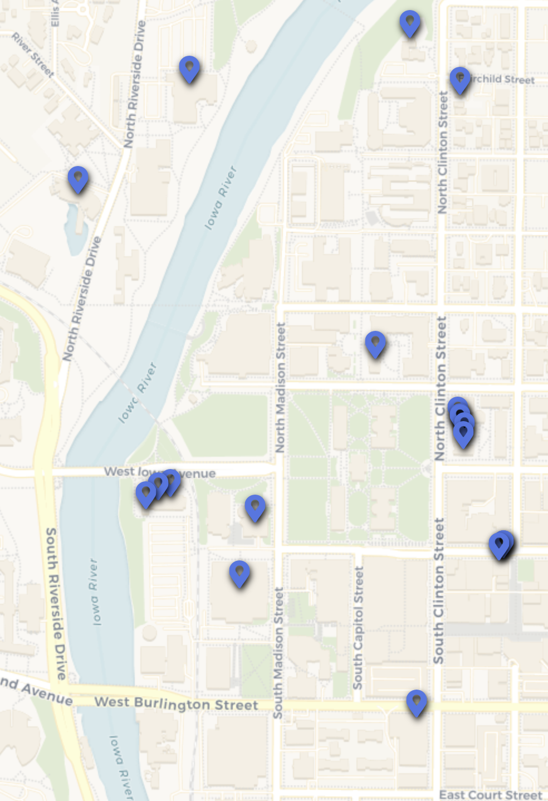

---
aliases:
  - Arts and Liberal Arts
Steward_Area: 🔵 Blue
---
%% DATAVIEW_PUBLISHER: start
| Programs                                |
| --------------------------------------- |
| <ul><li>Arts and Liberal Arts</li></ul> |

%%

| Programs                                |
| --------------------------------------- |
| <ul><li>Arts and Liberal Arts</li></ul> |

%% DATAVIEW_PUBLISHER: end %%

# Steward:
%% DATAVIEW_PUBLISHER: start
| Steward                                                                 | Email                      |
| ----------------------------------------------------------------------- | -------------------------- |
| [Aileen Tierney](./Aileen%20Tierney.md) | aileen.j.tierney@gmail.com |

%%

| Steward                                                                 | Email                      |
| ----------------------------------------------------------------------- | -------------------------- |
| [Aileen Tierney](./Aileen%20Tierney.md) | aileen.j.tierney@gmail.com |

%% DATAVIEW_PUBLISHER: end %%

# Departments:

%% DATAVIEW_PUBLISHER: start
- [Administration](./Administration.md)
- [African American Studies](./African%20American%20Studies.md)
- [American Studies](./American%20Studies.md)
- [Art and Art History](./Art%20and%20Art%20History.md)
- [Asian and Slavic Languages](./Asian%20and%20Slavic%20Languages.md)
- [Cinematic Arts](./Cinematic%20Arts.md)
- [Creative Writing](./Creative%20Writing.md)
- [English](./English.md)
- [French and Italian](./French%20and%20Italian.md)
- [Gender, Women's, and Sexuality Studies](./Gender,%20Women's,%20and%20Sexuality%20Studies.md)
- [German](./German.md)
- [Graduate Student Aid Support](./Graduate%20Student%20Aid%20Support.md)
- [International Writing](./International%20Writing.md)
- [Library and Information Sciences](./Library%20and%20Information%20Sciences.md)
- [Linguistics](./Linguistics.md)
- [Music](./Music.md)
- [Philosophy](./Philosophy.md)
- [Photography and Sculpture](./Photography%20and%20Sculpture.md)
- [Religious Studies](./Religious%20Studies.md)
- [Rhetoric](./Rhetoric.md)
- [Spanish and Portuguese](./Spanish%20and%20Portuguese.md)
- [Theatre](./Theatre.md)
- [Blue Area](Blue%20Area.md)

%%

- [African American Studies](./African%20American%20Studies.md)
- [American Studies](./American%20Studies.md)
- [Administration](./Administration.md)
- [Art and Art History](./Art%20and%20Art%20History.md)
- [Asian and Slavic Languages](./Asian%20and%20Slavic%20Languages.md)
- [Cinematic Arts](./Cinematic%20Arts.md)
- [Creative Writing](./Creative%20Writing.md)
- [English](./English.md)
- [French and Italian](./French%20and%20Italian.md)
- [German](./German.md)
- [Gender, Women's, and Sexuality Studies](./Gender,%20Women's,%20and%20Sexuality%20Studies.md)
- [Graduate Student Aid Support](./Graduate%20Student%20Aid%20Support.md)
- [International Writing](./International%20Writing.md)
- [Library and Information Sciences](./Library%20and%20Information%20Sciences.md)
- [Linguistics](./Linguistics.md)
- [Music](./Music.md)
- [Philosophy](./Philosophy.md)
- [Photography and Sculpture](./Photography%20and%20Sculpture.md)
- [Rhetoric](./Rhetoric.md)
- [Religious Studies](./Religious%20Studies.md)
- [Spanish and Portuguese](./Spanish%20and%20Portuguese.md)
- [Theatre](./Theatre.md)
- [Blue Area](Blue%20Area.md)

%% DATAVIEW_PUBLISHER: end %%

# Map:

