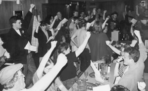

---
tags:
  - 📰-News
Date: 2011-09-09
Author: 
---
- [ ] #text-update This severely needs to be updated with contracts past 2010.

During the past few decades, graduate students have faced an increasingly burdensome workload and uncertain future. As tenure track positions have disappeared, the University of Iowa and other universities have turned to graduate employees as a source of cheap part-time labor. Graduate employees at the University of Iowa are now responsible for over 50% of the hours undergraduates spend with instructors, research assistants work long hours in labs and libraries, and graduate assistants make sure the university functions on a daily basis. This shift, away from tenured faculty towards increasing dependence on graduate assistants and adjunct faculty, has been a result of downsizing and the “corporatization” of universities across the country.

## The Beginnings of Change at UI

Over the summer of 1993, COGS members researched labor law, the daily operations of the University, and graduate employee working conditions. In the fall, COGS voted to affiliate with the Service Employees International Union (SEIU). Over the next six months COGS/SEIU mobilized hundreds of graduate employees and, in the spring of 1994, over 600 graduate employees voted YES for the Union, just 70 votes short of a victory.

## Organizing the path to success

Despite this electoral defeat, COGS’ organizing efforts led to improved working conditions for graduate employees. In response to the COGS campaign, the administration raised graduate employee salaries, began for the first time to contribute a small amount toward heath insurance, and increased funding for child care. Over the next year, COGS activists held meetings and kept the vision of a democratic workplace alive. In the fall of 1995, members voted to affiliate with the United Electrical, Radio, and Machine Workers of America (UE). The members decided that the UE’s commitment to democratic unionism and its experience representing thousands of public sector workers in the state of Iowa made it an ideal choice.

## From Campaign to Local Union: The First Contract

Throughout the 1996-97 academic year, COGS members continued to pressure the University for a fair agreement. Special actions included a “grade-in” to demonstrate the critical role of teaching assistants and a Martin Luther King Day protest of the administration’s refusal to include a no-discrimination clause in the contract. Despite this protest, the University held fast in its refusal to discuss discrimination language at the bargaining table. While deeply disappointed and shocked by this hypocrisy, COGS members did approve a first contract which included several important victories: a solid grievance procedure; an affordable, comprehensive health care plan (UIGradCare); guaranteed base salaries; and fair policies on such issues as appointment letters, sick leave, family illness and bereavement leave, work rules, and time off over inter-session break.

## Strengthening the Union and Making Gains: The Second Contract

COGS continued to grow and change in its second year. Organizing drives educated new students about the union and kept membership numbers steady. A constitutional review committee devised several key changes which were approved by the membership in the spring of 1997. These changes resulted in a more efficient leadership structure with an emphasis on many COGS members giving manageable amounts of time to union work.

To prevent the University from dismantling gains made in the first contract, many of the strategies used during the first contract negotiations were revived for the second contract fight: members organized a “grade-in,” kept communication flowing between members and the Bargaining Committee, and held informational pickets and protests. A large number of COGS members organized to pressure for action on child care issues and a no-discrimination clause.

Thanks in part to pressure from COGS members for a voluntary settlement, a second contract agreement was reached just days before the deadline to submit the contract to arbitration. Approved overwhelmingly by a membership ratification vote in February 1999, the 1999-2001 contract preserved critical elements of the first contract, and added: inexpensive dental and mental health care, base salary increases, clarifications of summer pay rates, a memorandum providing for union representation in cases of workplace discrimination, and, for the first time, a 70% contribution from the University towards the cost of health care coverage for employees’ families. Child care pressure undoubtedly played a role in achieving the family health care contribution.

Perhaps the most frustrating challenge for the Union in the fall of 1999 came when the University converted to a new payroll software application. Despite assurances that the process would go smoothly, scores of TAs and RAs were underpaid or not paid at all for two months in a row -- along with hundreds of other University employees. COGS challenged the University's nonchalant attitude toward what was, for many RAs and TAs, a financial crisis. COGS members organized public pressure while stewards and officers vigorously pursued in-house resolutions of the issue. The result was an overwhelming public condemnation of the University's failure to pay its employees. Within days, the University agreed to set up an immediate-response system to give TAs and RAs "temporary paychecks." Ever vigilant, the Union kept close watch over the payroll snafu, fighting for the full payment of University employees and supporting the Payroll & Benefits staff -- overworked and on the front lines of an administrative misstep -- in their call for more help from the university administration.

## An Established Union Holds Strong: The Third Contract

COGS began negotiating its third contract in late fall of 2000. Although the Bargaining Committee spent an exhausting month discussing tuition waivers with the University, the University was ultimately unwilling to agree to a fair tuition waiver plan. Nonetheless, the Union made important gains such as same-sex domestic partner health insurance coverage, increased employer contributions to health and dental care premiums, a 70% employer contribution to dependent dental coverage in the second year of the contract, the inclusion of outpatient substance abuse coverage, a 4% raise for returning employees, and improved language regarding appointment letters.

## Tuition Scholarships for All: The Fourth Contract

As the 2002-2003 academic year began, slashed state and university budgets were a nationwide phenomenon. Draconian cuts in funding for higher education coupled with attacks on public sector union workers by the Iowa state legislature only served to intensify the urgency of COGS’ work. In spite of a grim bargaining situation for state employees, COGS members managed to negotiate an impressive contract that, notably, protected both salaries and health insurance benefits against attempts to diminish them, and, **for the first time ever, secured an acceptable partial tuition remission plan for graduate employees**.

A pair of significant victories came in 2004 when COGS filed and successfully won two overwork grievances. In both cases, the affected employees won hundreds of dollars of back pay and the affected classes were restructured to keep workload within the appointment percentage. During this time, COGS stewards and members also vociferously defended their contract, successfully beating back attempts to ignore sick leave and paid leave rights by the UI.

## Net Compensation Gains and Job Security: The Fifth Contract

As negotiations for the fifth contract began in the Fall of 2004, COGS members were determined to make gains in the areas of tuition scholarships, salaries, and job security. After months of bargaining and member action, the fifth contract was settled in the Spring of 2005. The University’s concessionary demands on health insurance had been warded off. Increases in pay and tuition scholarships enlarged average graduate employee net compensation (take-home-pay) by more than 6%. In addition, new language was crafted that committed departments to honoring initial offers of employment length, gave employees the right to grieve below standard evaluations, and required departments to provide employees written descriptions of their duties and associated time expectations.

## Contract Victories and Increased Net Compensation: The Sixth Contract

UE-COGS started the Fall of 2006 with a significant arbitration victory preserving the right to University-provided training for hundreds of international graduate assistants. The University threatened to appeal this decision to get it overturned, but COGS members held firm and expressed their outrage over this disregard for the negotiated arbitration procedure. The University finally relented on this issue and compensated the affected graduate assistants.

While COGS has made remarkable gains during its history, much remains to be done. Serious issues remain, including improving child care support, securing protection from overwork, and gaining full tuition scholarships for all graduate employees. Some of these issues can only be addressed in negotiations. Others, like overwork, can be addressed by utilizing our grievance procedure and steward system.

Protecting and improving upon past gains will require the same level of vigilance and activism that COGS members demonstrated during the past. And, of course, organizing must always continue. Only by organizing; emphasizing the importance of the Union to new employees; and maintaining our strength as a militant, active union will COGS’ past success continue into the future.

On many campuses, university administrations have attempted to prevent union campaigns by asserting that teaching and research assistants are "not employees." Created especially for the UE-COGS campaign by UE cartoonist Gary Huck, this cartoon made the point that graduate employees do work for their paychecks... and that workplace problems cannot be solved simply through "collegiality," as was asserted by the university's Graduate College.

## UE-COGS Proud History of Salary Increases at the UI

|   |   |   |
|---|---|---|
|**Year**|**Minimum Half-Time Academic Year Salary**|**Negotiated Increase**|
|1995-1996|$10,500|--|
|1996-1997|$12,500|19%|
|1997-1998|$12,778|2%|
|1998-1999|$13,320|4%|
|1999-2000|$13,720|3%|
|2000-2001|$14,130|3%|
|2001-2002|$14,718|4%|
|2002-2003|$15,330|4%|
|2003-2004|$15,330|0%**|
|2004-2005|$15,490|1%**|
|2005-2006|$15,736|1.5%|
|2006-2007|$15,985|1.5%|
|2007-2008|$16,277|1.8%|
|2008-2009|$16,574|1.8%|
|2009-2010|$16,575|0%#|

Since 1996-1997, UE-COGS has increased minimum salaries by 48%.

In the 2003-2005 contract UE-COGS achieved a partial tuition scholarship for all TAs and RAs as a way to counter incredibly high increases in tuition. For this contract, the membership agreed to put more money into the new scholarship benefit than into salaries as a way to protect net take-home pay. Currently, the minimum tuition scholarship is the equivalent of 25% of the cost of tuition. To illustrate, if an employee in 2003-2004 received the minimum salary of $15,330 and returned in 2004-2005 with a salary of $15,490 plus the 25% tuition scholarship, their net take home pay will have increased by 4%.

In the 2009-2011 contract UE-COGS negotiated what was thought to be a full tuition scholarship for all TAs and RA beginning in 2010-2011. It was negotiated at a dollar amount, and the cost of tuition increased beyond that allocated in the contract. In the 2011-2013 contract, 100% tuition is now covered at the College of Liberal Arts and Sciences tuition rate.

