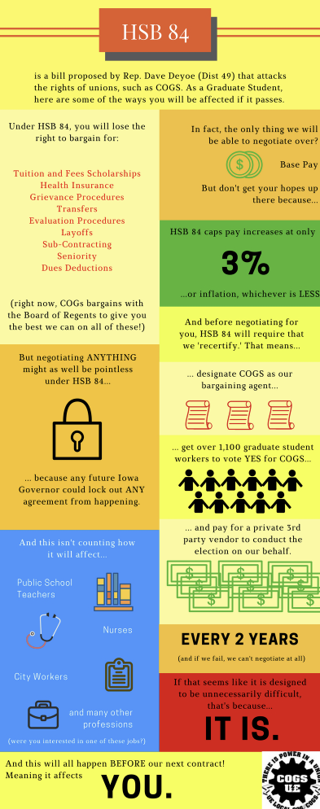

---
tags:
  - 🌎-Outside-UI/🌽-Iowa
Date: 2017-02-08
---

COGS! This is your call to arms. The Iowa legislature has introduced [HSB84](https://www.legis.iowa.gov/legislation/BillBook?ga=87&ba=Sf213). This bill is horrible: it goes even further than Wisconsin's Act 10 in busting unions and attacking our workers' rights. Below are some ways to FIGHT!

[Summary of the key points](https://drive.google.com/file/d/0B6ynSIul_QywcjhZY3J6OFFwWGM/view) [Flyer that explains its key provisions](https://drive.google.com/file/d/0B6ynSIul_QywMUFrS3BnMFp6WHc/view?usp=sharing)). We urge you to come to Des Moines to give testimony about the bill on Monday (02/13) at 6 pm! We would leave Old Brick at 3 pm and return after the proceeding. [Sign up!](https://www.legis.iowa.gov/committees/publicHearings?meetingID=24398&action=viewOnlineSignup). And carpool with COGS by signing up here! ([link](https://docs.google.com/spreadsheets/d/1SCzmIOF2ZsgLaLxr7U8CzgL8GnJ8NH-KHPhd2U8MgYY/edit#gid=0))

# Action Steps:

**1. Take 10 minutes to CALL and WRITE state legislators EACH DAY before it passes!**  
[Script for calling or writing](https://docs.google.com/document/d/1XYjp5AONAhLHXluWyTOxrF-O8AeClQPm9iryjQ2qDAs/edit?usp=sharing)). Some folks we think might be moved are listed below:  
- Michael Breitbach (District 28, Clayton County) (563)920-7399  [michael.breitbach@legis.iowa.gov](mailto:michael.breitbach@legis.iowa.gov)  
- Dan Dawson (District 8, Council Bluffs) (712)256-1199 [dan.dawson@legis.iowa.gov](mailto:dan.dawson@legis.iowa.gov)  
- Jeff Edler (District 36, Marshall County) (641)751-5902 [jeff.edler@legis.iowa.gov](mailto:jeff.edler@legis.iowa.gov)  
- Tom Greene (District 44, Burlington) (319)750-6579 [tom.greene@legis.iowa.gov](mailto:tom.greene@legis.iowa.gov)  
- Craig Johnson (District 32, Buchanan County) (319)334-2413 [craig.johnson@legis.iowa.gov](mailto:craig.johnson@legis.iowa.gov)  
- Mark Lofgren (District 46, Muscatine) (563)272-8683 [mark.lofgren@legis.iowa.gov](mailto:mark.lofgren@legis.iowa.gov)

**2. Ask ANYONE you know living in Iowa to call their state legislators EACH DAY!**  
If you have family or friends in Iowa (especially in Republican districts), tell them to take 5 minutes to call their state legislators EVERYDAY before this bill passes! You can tell your students, too [They can find their state legislators here](https://l.facebook.com/l.php?u=https%3A%2F%2Fwww.legis.iowa.gov%2Flegislators%2Ffind&h=ATMt25FKtaHwBM2Kg5mF43rHbX21_wcGJ0h6RaNCwgAFrTAKDb1obFKdKNbttm9TCw9mfloeZCQCYE7Fs1-7iusqXE6qCOD5uoFmFBW_hqBtNk-VE0S-NH3zVO9g2qc0maYLd1icb9x2tkcbyiCS&enc=AZPl0DuwrwG2O65zI972pa9jv0LXGGUJzExwOATIe5kRiyB-aV_6CUJTSY1-kRr4HPUgYunjDtUtZoU0pHNtTWmR3A2PD4ua9c7sJIBys39KFR9gvPrOAH6yJNu3nkwQqPKR2hZ27NTRseV7t0qknYBqw4qDUdJ2qooGKX3cdiUppBoY5HWMgmATYgfC9PEjvo9XzGc1LFtCOP_8IlKGj9U6&s=1)

**3. PHONE BANK!**  
We are asking folks to phone-bank for one-hour shifts from 5-8 pm on 02/09. Solidarity pizza is provided. [Sign up](https://docs.google.com/spreadsheets/d/1PbPIwD45mYh2pETsEpovYi5gVRBjkdtqx9fNwOrZcX0/edit))

**4. TELL EVERYONE – especially your fellow graduate workers!**  
Educating people about what is going on is critical. This is the time to join the fight. And this fight belongs to all graduate workers. Our healthcare and tuition coverage is on the line. Our union is on the line.  

