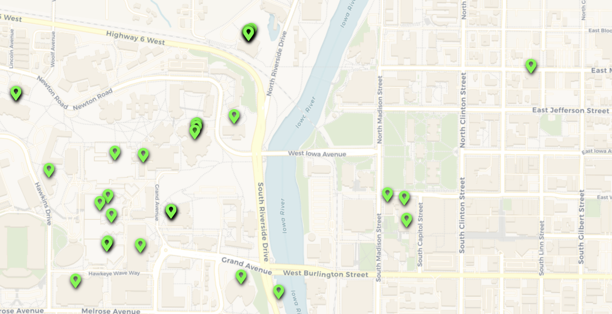

---
aliases:
  - Medicine, Law, Engineering, and Professional Studies
Steward_Area: 🟢 Green
---
- [ ] #🏢-department What about Toxicology or Molecular Medicine? I feel like there are some grad programs missing here.

%% DATAVIEW_PUBLISHER: start
| Programs                                                               |
| ---------------------------------------------------------------------- |
| <ul><li>Medicine, Law, Engineering, and Professional Studies</li></ul> |

%%

| Programs                                                               |
| ---------------------------------------------------------------------- |
| <ul><li>Medicine, Law, Engineering, and Professional Studies</li></ul> |

%% DATAVIEW_PUBLISHER: end %%

# Steward:

%% DATAVIEW_PUBLISHER: start
| Steward                                                                 | Email                |
| ----------------------------------------------------------------------- | -------------------- |
| [Miranda Schene](./Miranda%20Schene.md) | mir.schene@gmail.com |

%%

| Steward                                                                 | Email                |
| ----------------------------------------------------------------------- | -------------------- |
| [Miranda Schene](./Miranda%20Schene.md) | mir.schene@gmail.com |

%% DATAVIEW_PUBLISHER: end %%

# Departments:

%% DATAVIEW_PUBLISHER: start
- [Athletic Training](./Athletic%20Training.md)
- [Biomedical Engineering](./Biomedical%20Engineering.md)
- [Biostatistics](./Biostatistics.md)
- [Chemical and Biomedical Engineering](./Chemical%20and%20Biomedical%20Engineering.md)
- [Civil and Environmental Engineering](./Civil%20and%20Environmental%20Engineering.md)
- [Communication Sciences and Disorders](./Communication%20Sciences%20and%20Disorders.md)
- [Community and Behavioral Health](./Community%20and%20Behavioral%20Health.md)
- [Dental Research](./Dental%20Research.md)
- [Dermatology](./Dermatology.md)
- [Drug Discovery and Experimental Therapeutics](./Drug%20Discovery%20and%20Experimental%20Therapeutics.md)
- [Electrical and Computer Engineering](./Electrical%20and%20Computer%20Engineering.md)
- [Emergency Medicine](./Emergency%20Medicine.md)
- [Epidemiology](./Epidemiology.md)
- [Green Area](Green%20Area.md)
- [Health and Human Physiology](./Health%20and%20Human%20Physiology.md)
- [Hydroscience and Engineering](./Hydroscience%20and%20Engineering.md)
- [Hospital](./Hospital.md)
- [Internal Medicine](./Internal%20Medicine.md)
- [Law](./Law.md)
- [Mechanical and Industrial Engingeering](./Mechanical%20and%20Industrial%20Engingeering.md)
- [Microbiology](./Microbiology.md)
- [Molecular Physiology and Biophysics](./Molecular%20Physiology%20and%20Biophysics.md)
- [Neuroscience and Pharmacology](./Neuroscience%20and%20Pharmacology.md)
- [Neuroscience](./Neuroscience.md)
- [Nursing](./Nursing.md)
- [Occupational and Environmental Health](./Occupational%20and%20Environmental%20Health.md)
- [Pediatrics](./Pediatrics.md)
- [Pharmaceutical Sciences and Experimental Therapeutics](./Pharmaceutical%20Sciences%20and%20Experimental%20Therapeutics.md)
- [Pharmacy Practice and Science](./Pharmacy%20Practice%20and%20Science.md)
- [Physical Therapy and Rehabilitation Science](./Physical%20Therapy%20and%20Rehabilitation%20Science.md)
- [Preventative and Community Dentistry](./Preventative%20and%20Community%20Dentistry.md)
- [Psychiatry](./Psychiatry.md)
- [Public Health Administration](./Public%20Health%20Administration.md)
- [Public Health Statistics](./Public%20Health%20Statistics.md)
- [Public Policy Center](./Public%20Policy%20Center.md)
- [Radiology](./Radiology.md)
- [Research Department](./Research%20Department.md)
- [State and Community Project](./State%20and%20Community%20Project.md)
- [Surgery](./Surgery.md)
- [UI Technology](./UI%20Technology.md)

%%

- [Athletic Training](./Athletic%20Training.md)
- [Biostatistics](./Biostatistics.md)
- [Biomedical Engineering](./Biomedical%20Engineering.md)
- [Chemical and Biomedical Engineering](./Chemical%20and%20Biomedical%20Engineering.md)
- [Civil and Environmental Engineering](./Civil%20and%20Environmental%20Engineering.md)
- [Communication Sciences and Disorders](./Communication%20Sciences%20and%20Disorders.md)
- [Community and Behavioral Health](./Community%20and%20Behavioral%20Health.md)
- [Drug Discovery and Experimental Therapeutics](./Drug%20Discovery%20and%20Experimental%20Therapeutics.md)
- [Dental Research](./Dental%20Research.md)
- [Dermatology](./Dermatology.md)
- [Electrical and Computer Engineering](./Electrical%20and%20Computer%20Engineering.md)
- [Emergency Medicine](./Emergency%20Medicine.md)
- [Epidemiology](./Epidemiology.md)
- [Health and Human Physiology](./Health%20and%20Human%20Physiology.md)
- [Hydroscience and Engineering](./Hydroscience%20and%20Engineering.md)
- [Hospital](./Hospital.md)
- [Internal Medicine](./Internal%20Medicine.md)
- [Law](./Law.md)
- [Mechanical and Industrial Engingeering](./Mechanical%20and%20Industrial%20Engingeering.md)
- [Molecular Physiology and Biophysics](./Molecular%20Physiology%20and%20Biophysics.md)
- [Microbiology](./Microbiology.md)
- [Neuroscience and Pharmacology](./Neuroscience%20and%20Pharmacology.md)
- [Neuroscience](./Neuroscience.md)
- [Pharmaceutical Sciences and Experimental Therapeutics](./Pharmaceutical%20Sciences%20and%20Experimental%20Therapeutics.md)
- [Occupational and Environmental Health](./Occupational%20and%20Environmental%20Health.md)
- [Nursing](./Nursing.md)
- [Physical Therapy and Rehabilitation Science](./Physical%20Therapy%20and%20Rehabilitation%20Science.md)
- [Pediatrics](./Pediatrics.md)
- [Pharmacy Practice and Science](./Pharmacy%20Practice%20and%20Science.md)
- [Preventative and Community Dentistry](./Preventative%20and%20Community%20Dentistry.md)
- [Psychiatry](./Psychiatry.md)
- [Public Health Statistics](./Public%20Health%20Statistics.md)
- [Radiology](./Radiology.md)
- [Public Health Administration](./Public%20Health%20Administration.md)
- [Public Policy Center](./Public%20Policy%20Center.md)
- [State and Community Project](./State%20and%20Community%20Project.md)
- [Research Department](./Research%20Department.md)
- [Surgery](./Surgery.md)
- [UI Technology](./UI%20Technology.md)
- [Green Area](Green%20Area.md)

%% DATAVIEW_PUBLISHER: end %%

# Map:
