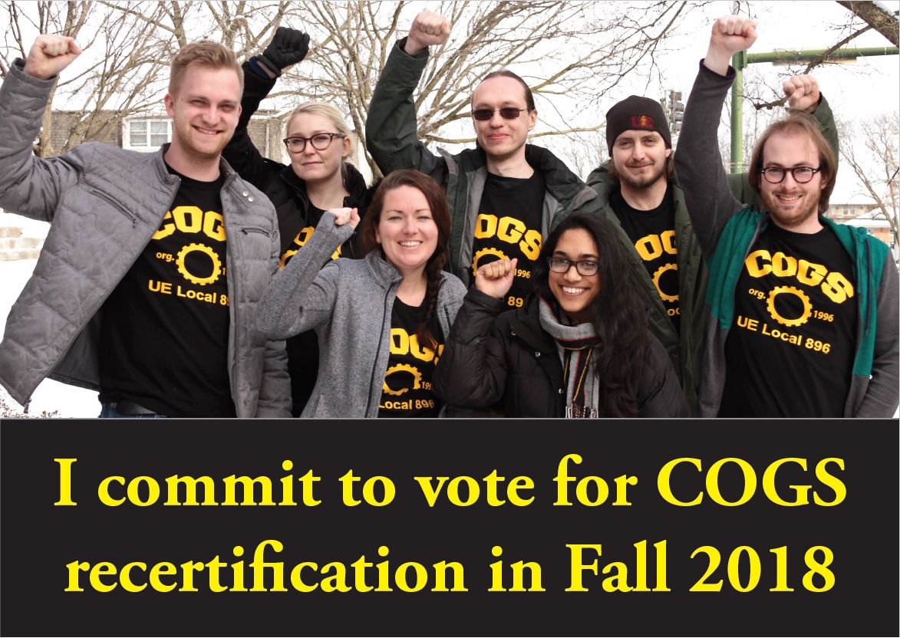

---
tags:
  - ✅-Recertification
Date: 2020-08-25
Author:
  - "[Kenneth Elliott](Kenneth%20Elliott.md)"
---
By: Kenneth Elliott, former VP of Organizing, 2018-2019

Amidst everything going on this fall, an especially important election is coming up for graduate workers at the University of Iowa.  While the election in November is certainly important, the election I’m talking about is COGS’s recertification election.  Because of law changes by the Iowa legislature in 2017, every public sector union in the state now has to recertify before every bargaining session (every two years for most unions).  Failure to recertify means COGS immediately ceases to officially represent graduate workers on campus and collective bargaining no longer happens.

If this were a fair election, I would not be concerned.  The vast majority of graduate students recognize that the union has massively improved the condition of graduate workers on campus. However, the election process is designed to be unnecessarily difficult.  COGS is required to pay over $2000 to an independent contractor to run the election.  And while the vote takes place over a 2 week period, in order to pass, the union needs a majority of the bargaining unit (in our case, all graduate workers, a group of about 2000 people) to actively vote yes.  Not voting is identical to voting _against_ the union.  Can you imagine how many vacancies our government would have if the elected politicians who wrote this law had to win election by a majority of all possible voters, and not just a majority of those who voted?

When the first recertification election was forced on us in 2018, I was Vice President of COGS and head of organizing.  I knew that winning the election was not going to be easy.  The organizing committee spent months focused on developing strategies to spread the word: opinion pieces in the local news, postcards for graduate workers to fill out that we mailed to them shortly before the election, social media posts, handouts, and many, many office visits around campus.  In the fall, I let my dissertation adviser know that I was unlikely to get any substantial work done in October when the election was happening.

Just to be clear, the university wants this election to happen.  If they cared about graduate workers, they could (as several local governments did that year) just cancel the recertification.  Instead, they chose to bury the information about it.  Faculty and staff were instructed not to discuss the election with their graduate students.  The legally-mandated emails sent out by the administration were nothing but links to the Iowa state code, written in such unclear legalese that even I didn’t recognize what they were about.

In the end, the vote in 2018 reaffirmed the support COGS has on campus.  The final vote was 1559 votes for the union and 11 against, with over 80% of the bargaining unit voting.  Graduate workers across campus, union members or not, clearly recognized the value of having a union.  Given how active, involved, and visible COGS has been this summer, I’m sure that support has only grown.

However, the pandemic this year presents a number of logistical issues we didn’t face in 2018.  While some students will remember the election in 2018, over half of graduate workers this year were not here in 2018.  We heavily relied on office visits and one-on-one conversations to inform graduate workers about the recertification vote; this year, office visits will be neither effective nor safe.  Postcards and fliers will be equally ineffective.  We need new, digital strategies to ensure graduate workers are informed and motivated to vote.  I have full confidence that COGS will again turn out a massive show of support in the recertification election... but at the same time, I’m relieved I’m not responsible for planning it this year.

