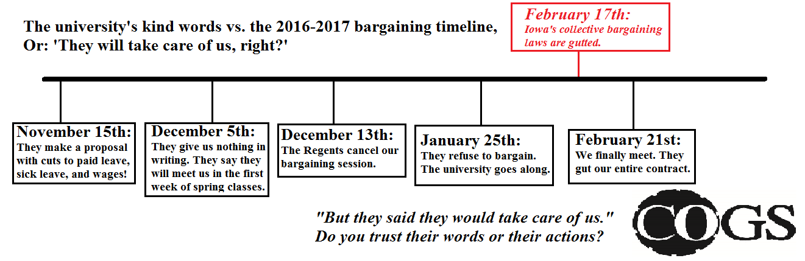

---
tags:
  - 🥊-COGSvBOR
Date: 2017-02-27
---
The University of Iowa and Board of Regents are **cutting** from our contract:
1. all our holidays (yes, they literally cancelled Christmas)
2. our hours of work (they could arbitrarily double your hours)
3. our grievance procedure to resolve workplace disputes
4. their commitment to human rights and ending discrimination (yes, really)
5. sick leave for things like hospitalization
6. bereavement leave for the death of a loved one
7. paid leave for conferences
8. their commitment to provide a safe work environment (yes, really)
9. their commitment to provide us with job training.

See the flyer below. Below is also a bargaining timeline.

