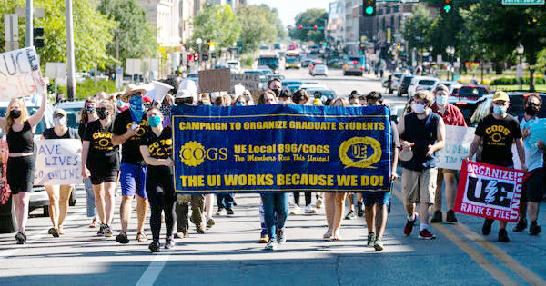
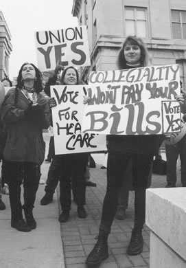
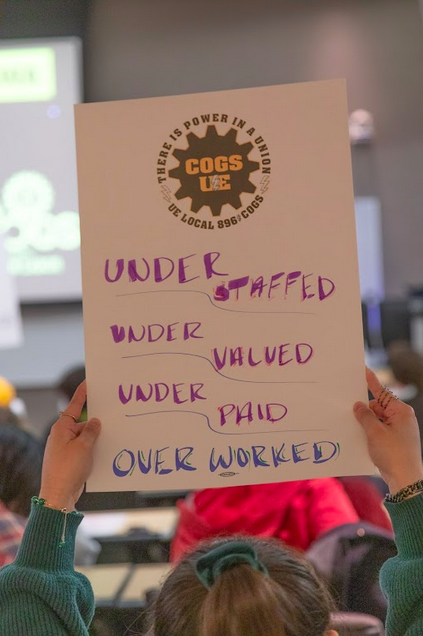
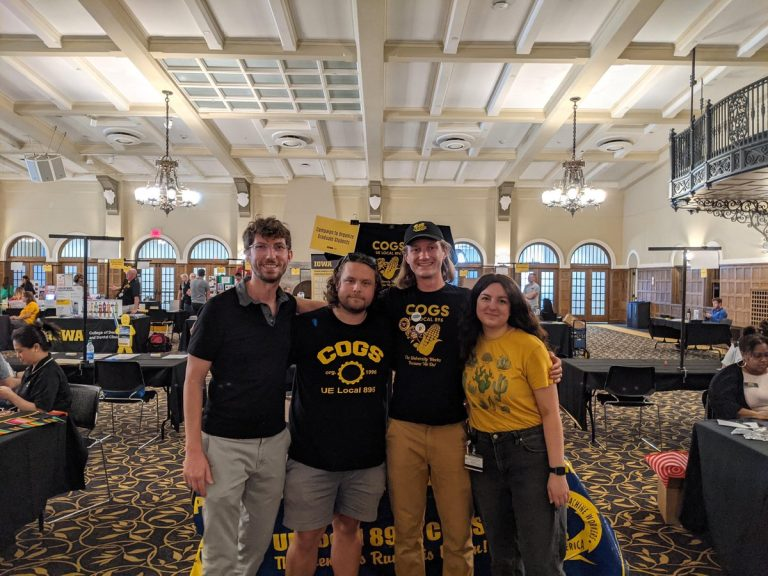
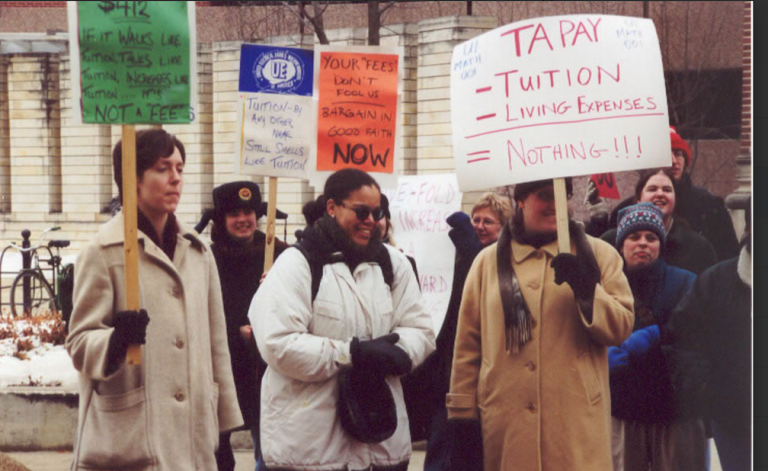
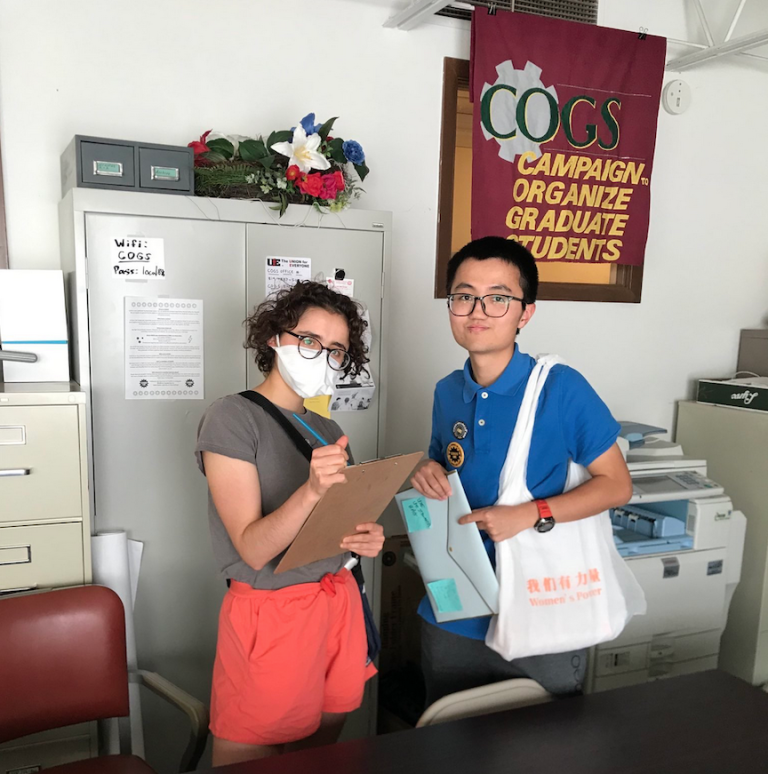
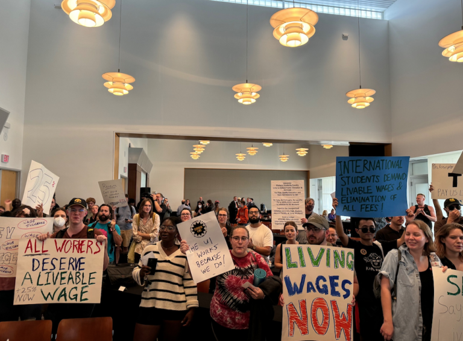

---
tags:
  - 🏠-Homepage
---
- [ ] #text-update Update with following FAQs: 

# FAQs to Add:
- ==I think I should have a what is COGS type FAQ page and one that that deals more with membership.
- Who is COGS? (link to history page – stress democratic provisions in constitution)
- Who is UE?
- Union membership – why it matters
- How do I become a member
- How do I end my membership
- How much is a COGS membership
- Where does my dues money go?
- Chapter 20
- Contract rights
- How do I sign up for health insurance?

%% DATAVIEW_PUBLISHER: start
| Last-Updated |
| ------------ |
| May 25, 2025 |

%%

| Last-Updated |
| ------------ |
| May 11, 2025 |

%% DATAVIEW_PUBLISHER: end %%

> [!question]- What is COGS?
> COGS is your graduate student labor union. We are graduate workers organizing for our collective benefit. We are legally recognized by the state to negotiate terms of employment for graduate workers at the University of Iowa.

> [!question]- Why Have a Union?
> In short: the bosses are organized, so we need to be too! Our wages are getting lower in real terms every year (lagging behind inflation); graduate workers do not have paid parental leave; graduate workers often find themselves in abusive or coercive situations, with few options for help.
> 
> Without a union, graduate education is more costly, more stressful, and less accessible – particularly to people with marginalized identities and/or immigration statuses and/or who have fewer financial resources.
> 
> With a union, we have the power to fight for our collective benefit and make graduate education what we want it to be. As the COGS saying goes: **Collegiality won't pay your bills!**
> 

> 

> [!question]- What Does COGS Do?
> We fight for graduate workers. Whereas HR and other university offices are fighting to protect the university’s bottom line and liability, we are fighting for you. Full stop.
> 
> Since COGS was established in 1996, we have won…
> - Full tuition remission
> - 50% reduction in mandatory fees
> - Better healthcare - with UI paying 90% of single premiums & 70% of dependent premiums
> - Protections against overwork & an effective grievance procedure
> - …and more!
> 
> But COGS also works everyday to make sure that graduate workers rights, per university policy and our contract, are protected. Every semester, we help graduate workers win back pay from overwork and we help graduate workers organize their workplaces for better working conditions.
> 
> 

> [!question]- How Do I Know If I am in the Union?
> If you are a graduate student with an academic appointment at the University of Iowa, you are more than likely part of the **COGS bargaining unit** - that means that when we bargain a contract, you are covered by that contract.
> 
> However, because Iowa is a [right-to-work state](https://iowastartingline.com/2023/05/24/what-does-iowas-right-to-work-law-mean/), graduate student workers are not automatically a **member of COGS**. That means everyone is covered by the contract and benefits from our wins, but only COGS members pay monthly dues to the union, have a vote in what we do, and are able to run for leadership positions.

> [!question]- What If I am Not in the Bargaining Unit?
> Although most teaching assistants (TAs) and research assistants (RAs) are in the COGS bargaining unit, there are some whose positions are not covered ([Why?](https://magazine.scienceforthepeople.org/labor-special-issue/science-work-and-service-work/)), particularly in the biomedical sciences. The University has pushed for exclusions from the bargaining unit in order to try and suppress the union's power.
> 
> If you are not in the bargaining unit, you are not guaranteed a raise when we bargain for raises to our base pay in our contract. However, you are still covered by University policy like all graduate workers are. As a union, a big part of our work is ensuring that the University is not violating university policy and helping workers to organize their workplaces and file grievances when violations or other injustices do occur.
> 
> Additionally, we aim to serve as an organizing hub for graduate students. That means we know that the conditions we work under are unjust (including conditions that are allowed under university policy and our contract) and we are fighting for a better workplace, standard of living, and graduate education for all of us.
> 
> So if you are not in the bargaining unit because you are on fellowship or are a TA/RA which the UI has excluded from the bargaining unit, we encourage you to still become a member of COGS and organize!

> [!question]- Why Become a Member and Pay Dues?
> Without dues, our union will cease to exist. All the funds we need to organize everyday, including the rent for our office and the materials to organize, are funded by dues money. We have a budget report at every monthly General Meeting so everyone knows and has a say in what their dues money is going to. You can become a member by clicking [here](https://cogs.org/product/cogs-dues)!

> [!question]- Are Unions Legal?
> Yes! Public employees in Iowa have the legal right to unionize, per Iowa Code [Chapter 20](https://www.legis.iowa.gov/docs/ico/chapter/20.pdf). You can read more about Iowa public sector labor law here: [Chp 20](../Admin/Attachments/chapter20.pdf).

> [!question]- Who Runs COGS?
> COGS is run by graduate student workers like you. Every year COGS members elect graduate workers to be on the [Coordinating Committee](../Events/Coordinating%20Committee.md) to make important decisions about what issues we organize around.
> 
> Every member has the right to run for a leadership position and we elect new members of the CC in the spring of every year to begin tenure the following fall.
> 
> 

> [!question]- When Was COGS Started?
> Graduate students in Iowa unionized in 1996 as the Campaign to Organize Graduate Students with the national union of the United Electrical, Radio, and Machine Workers of America (UE). Read more about COGS history at [Brief History of COGS](../Admin/Categories/News/Brief%20History%20of%20COGS.md). Why organize with UE? Graduate workers were drawn to UE’s [rank-and-file unionism](https://www.ueunion.org/aimsintr.html). We wanted a union run by and for graduate workers.
> 
> 

> [!question]- What Does a Union Do?
> A union is a group of organized workers who join together to improve our lives and working conditions by organizing to demand higher pay, better benefits, life-saving safety measures, and more.
> 
> In the absence of a union, individual workers get whatever they can beg for. With a union, workers leverage our collective power to bargain with our employer to get things like health care and tuition coverage. (At UI, we have both of these things because COGS fought for them!) 
> 
> Employers—particularly a state university—are powerful and well-resourced. Unionizing harnesses the power of workers.
> 
> Read more about the surge in graduate student worker unionizing [here](https://www.forbes.com/sites/michaeltnietzel/2022/12/16/as-grad-student-unionizing-effort-grows-universities-raise-stipends-benefits/?sh=2a2ad9da2af6).

> [!question]- Wait...Why Do I See a Line on my U-Bill that Says COGS Fees?
> This represents the 50% reduction in mandatory fees our union won - note that it is a _credit_ (not a payment)!

## INTERNATIONAL STUDENTS

> [!question]- As an International Student Can I Be a Member of COGS?
> Yes. Anyone can be a dues-paying member of COGS! International students are a critical part of our union. All of the issues we face are felt most acutely by international students and our union would not be what it is today without the work of international students’ organizing. We have many international students from a variety of departments who are members and who are in leadership positions! We would love for you to join us!
> 
> 

> [!question]- Can I Join a Union in the United States if I am Here on a Foreign Student Visa?
> Yes. Every international graduate student, regardless of national origin or type of visa, has the right to join a union. Your right to belong to a union is protected by the right to freedom of association guaranteed in the United States Constitution. 
> 
> Moreover, whether or not you are a citizen of the U.S., as a TA or RA you are a public employee of the state of Iowa. The Public Employee Relations Act of the State of Iowa says: “Public employees shall have the right to: 
> 1. Organize, or form, join, or assist any employee organization. 
> 2. Negotiate collectively through representatives of their choosing. 
> 3. Engage in other concerted activities  for the purpose of collective bargaining or other mutual aid or protection. . . .”
> 
> This means that you can join and participate in the union **without fear**. Under the law: No one can threaten your job or benefits. No one can threaten your stay in the U.S. (e.g., you will not be deported, or have your immigration status changed or revoked). No one can threaten your standing in your academic program.

> [!question]- Does the international student visa restriction on outside employment impact my right to be in a union?
> The visa requirement that foreign students may only accept employment associated with the university they attend in no way compromises the right to belong to a union. Graduate employees have formed unions and bargained contracts at many schools, and graduate employee unions have existed for almost 40 years. None of the campuses with unions have reported any complications arising from the dual status of being both a foreign student and a unionized employee. It is against the law for your employer (the University) to discriminate against you on the basis of your union membership or participation in legal union activities.
> 
> That discrimination exists against international students, however, is clear. This is another reason why international students should join a union and help fight for more protections. Only with a union, independent of the University administration, can you be assured that if you are subject to discrimination by the administration that there is a group that will stand behind you and will help to defend you.

> [!question]- Are There Any Restrictions on my ability to participate in union activities such as picketing, rallies, and leafleting?
> Political activities such as picketing, rallies, leafleting, demonstrations, etc., are forms of expression and free association, which are protected for foreigners in the U.S. (including foreign students with visas) as they are for U.S. nationals. It is against the law for your employer (the University) to retaliate against you for participating in these protected activities.
> 
> Iowa labor law section [20.10.3](https://cogs.org/chapter20-faqs) prohibits protesting in a way that blocks entrances (g), striking (h), and picketing for any unlawful purpose (i). But section 20.8 permits all other concerted activities outside of the listed exclusions.
> 
> Our leadership is well-versed in these provisions and strategizes in accordance with these laws.
> 
> 

> [!question]- Will my membership and participation affect my employment status or future visa applications?
> No. It is against the law for U.S. Citizenship and Immigration Services (USCIS) to ask you questions about your union membership or your legal union activities or to take them into account when reviewing your visa application. In the past there was a question on the visa application form asking the applicant about his/her union activities. But this question was removed from the application form several years ago.
> 
> Further, when you join COGS, your membership is private. COGS does not report your membership to your home country, to your home university, or to your University of Iowa academic or work department.

> [!question]- Why am I Paying So Much in Fees?
> All graduate workers pay fees, but international students are required to pay additional fees. For the [year](https://grad.admissions.uiowa.edu/cost/education-estimated-costs-international) 2023-2024, the matriculation fee for international graduate students is $325 and first semester and returning students pay $250 per fall and spring semesters and $67.50 per summer semesters.
> 
> The University says the fees are necessary to pay for services on campus and that international student fees are needed to fund the ISSS. But just like a cashier should not have to bring a cash register to work with them, you should not have to pay to work. When COGS won reductions in fees in the past, this did not correspond to reductions in services. They are making you pay because you are the most vulnerable worker and they believe you will not speak out against it. 
> 
> That is why our union is launching our End the Fees campaign to end all fees, because you should not have to pay to work! Read more about our [End the Fees Campaign](../Admin/Categories/Money/End%20the%20Fees%20Campaign/index.md).

> [!question]- As an International Student, Why Should I Join?
> International graduate students have many reasons to join a union. First, the union can provide a voice and advocacy for international graduate students who don’t always know the U.S. university system. Second, the union can help ensure that departmental hiring practices are clear, open, and fair so that international graduate students don’t miss out on work opportunities. Third, since U.S. law prohibits international students from being paid for more than 20 hours per week, making sure that the minimum stipend guarantees a decent living standard is even more critical. Fourth, better and more affordable benefits, a fair and enforceable grievance procedure, higher wages, a voice in our working conditions, and respect as employees are things all grads and their families deserve.

