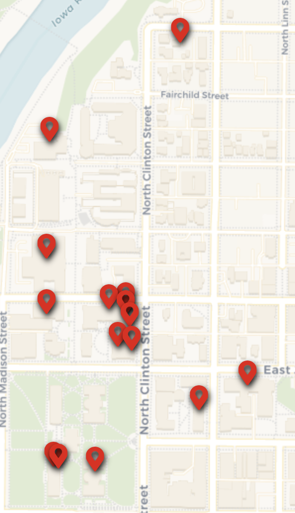

---
aliases:
  - Physical Sciences and Economics
Steward_Area: 🔴 Red
---
%% DATAVIEW_PUBLISHER: start
| Programs                                          |
| ------------------------------------------------- |
| <ul><li>Physical Sciences and Economics</li></ul> |

%%

| Programs                                          |
| ------------------------------------------------- |
| <ul><li>Physical Sciences and Economics</li></ul> |

%% DATAVIEW_PUBLISHER: end %%

# Steward:
%% DATAVIEW_PUBLISHER: start
| Steward                                                         | Email              |
| --------------------------------------------------------------- | ------------------ |
| [Andy Minot](../../Admin/Categories/Members/Officers/Andy%20Minot.md) | Dusty826@gmail.com |

%%

| Steward                                                         | Email              |
| --------------------------------------------------------------- | ------------------ |
| [Andy Minot](../../Admin/Categories/Members/Officers/Andy%20Minot.md) | Dusty826@gmail.com |

%% DATAVIEW_PUBLISHER: end %%

# Departments:
%% DATAVIEW_PUBLISHER: start
- [Accounting](../../Admin/Departments/Accounting.md)
- [Biology](../../Admin/Departments/Biology.md)
- [Business Analytics](../../Admin/Departments/Business%20Analytics.md)
- [Chemistry](../../Admin/Departments/Chemistry.md)
- [Computer Science](../../Admin/Departments/Computer%20Science.md)
- [Earth and Environmental Sciences](../../Admin/Departments/Earth%20and%20Environmental%20Sciences.md)
- [Economics](../../Admin/Departments/Economics.md)
- [Entrepreneurial Center](../../Admin/Departments/Entrepreneurial%20Center.md)
- [Finances](../../Admin/Departments/Finances.md)
- [Marketing](../../Admin/Departments/Marketing.md)
- [Mathematics](../../Admin/Departments/Mathematics.md)
- [Obermann Center for Advanced Studies](../../Admin/Departments/Obermann%20Center%20for%20Advanced%20Studies.md)
- [Physics and Astronomy](../../Admin/Departments/Physics%20and%20Astronomy.md)
- [Social Work](../../Admin/Departments/Social%20Work.md)
- [Statistics and Actuarial Sciences](../../Admin/Departments/Statistics%20and%20Actuarial%20Sciences.md)
- [Red Area](Red%20Area.md)

%%

- [Accounting](../../Admin/Departments/Accounting.md)
- [Biology](../../Admin/Departments/Biology.md)
- [Business Analytics](../../Admin/Departments/Business%20Analytics.md)
- [Chemistry](../../Admin/Departments/Chemistry.md)
- [Computer Science](../../Admin/Departments/Computer%20Science.md)
- [Economics](../../Admin/Departments/Economics.md)
- [Earth and Environmental Sciences](../../Admin/Departments/Earth%20and%20Environmental%20Sciences.md)
- [Entrepreneurial Center](../../Admin/Departments/Entrepreneurial%20Center.md)
- [Finances](../../Admin/Departments/Finances.md)
- [Marketing](../../Admin/Departments/Marketing.md)
- [Mathematics](../../Admin/Departments/Mathematics.md)
- [Obermann Center for Advanced Studies](../../Admin/Departments/Obermann%20Center%20for%20Advanced%20Studies.md)
- [Physics and Astronomy](../../Admin/Departments/Physics%20and%20Astronomy.md)
- [Social Work](../../Admin/Departments/Social%20Work.md)
- [Statistics and Actuarial Sciences](../../Admin/Departments/Statistics%20and%20Actuarial%20Sciences.md)
- [Red Area](Red%20Area.md)

%% DATAVIEW_PUBLISHER: end %%

# Map:
