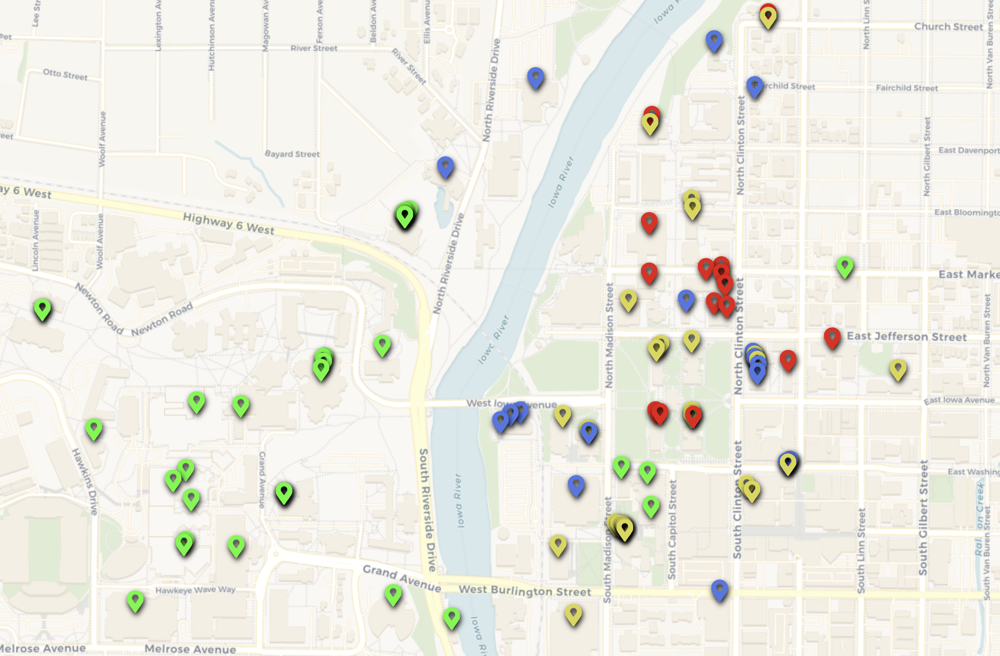

%%
```leaflet
id: Steward Map
minZoom: 15
maxZoom: 30
lat: 41.66110621781841
long: -91.54030654615535
# marker: default, 41.66247325145121, -91.53912072901197
marker: Yellow Steward Area, 41.661643117077986, -91.53079272909014, [[Psychological Brain Science]]
marker: Yellow Steward Area, 41.662155143277346, -91.53570448650717, [[Anthropology]]
marker: Yellow Steward Area, 41.65850923598371, -91.53887812883575, [[Art Museum]]
marker: Yellow Steward Area, 41.66466311042834, -91.53571207684094, [[Belin Blank Gifted Center]]
marker: Yellow Steward Area, 41.65995313006535, -91.53340352333419, [[Classics]]
marker: Yellow Steward Area, 41.66057054078271, -91.53816136037112, [[Communication Studies]]
marker: Yellow Steward Area, 41.6628761007001, -91.5372076358365, [[Dance]]
marker: Yellow Steward Area, 41.65887562370103, -91.53735630185005, [[Educational Administration]]
marker: Yellow Steward Area, 41.658803482548166, -91.53729192883571, [[Education Policy and Leadership]]
marker: Yellow Steward Area, 41.658827529608125, -91.53731338650715, [[Evaluation and Assessment Center]]
marker: Yellow Steward Area, 41.662073336426594, -91.53642802698567, [[Geography and Sustainability Sciences]]
marker: Yellow Steward Area, 41.660808666826846, -91.53571259477673, [[History]]
marker: Yellow Steward Area, 41.6618840900503, -91.53420995362758, [[Interdisciplinary Program]]
marker: Yellow Steward Area, 41.66451886974276, -91.53567988650715, [[Iowa Reading Research Center]]
marker: Yellow Steward Area, 41.658827529608125, -91.53731338650715, [[Iowa Testing Programs]]
marker: Yellow Steward Area, 41.660819086984894, -91.5387821781651, [[Journalism and Mass Communications]]
marker: Yellow Steward Area, 41.709323850478924, -91.60666564232855, [[Labor Center]]
marker: Yellow Steward Area, 41.65947209502686, -91.53426041266782, [[Information Technology Services|ITS]]
marker: Yellow Steward Area, 41.6617831906207, -91.53414394193341, [[World Languages, Literatures and Cultures]]
marker: Yellow Steward Area, 41.66089437055673, -91.53571152883575, [[Political Science]]
marker: Yellow Steward Area, 41.658859592340725, -91.53734557301432, [[Psychological and Quantitative Foundations]]
marker: Yellow Steward Area, 41.65728141246392, -91.5385216006613, [[Rec Services]]
marker: Yellow Steward Area, 41.65878745116989, -91.53730265767142, [[Rehabilitation and Counselor Education]]
marker: Yellow Steward Area, 41.66200242946175, -91.53654801534287, [[School of Urban and Regional Affairs]]
marker: Yellow Steward Area, 41.66601899721909, -91.53669816629521, [[Sociology and Criminology]]
marker: Yellow Steward Area, 41.65888594515477, -91.53752271904297, [[Teacher Leader Center]]
marker: Yellow Steward Area, 41.65886793960684, -91.5374519035524, [[Teaching and Learning]]
marker: Yellow Steward Area, 41.65957930289785, -91.53438729667299, [[Teaching, Learning, and Technology]]

marker: Red Steward Area, 41.66181150415307, -91.53341447431697, [[Biology]]
marker: Red Steward Area, 41.66315100079124, -91.5349176862495, [[Accounting]]
marker: Red Steward Area, 41.66343109258089, -91.5353655423733, [[Business Analytics]] 
marker: Red Steward Area, 41.66425346282371, -91.53670700184666, [[Chemistry]]
marker: Red Steward Area, 41.660895347377284, -91.53656162897047, [[Computer Science]]
marker: Red Steward Area, 41.66335845225274, -91.53672011780047, [[Earth and Environmental Sciences]]
marker: Red Steward Area, 41.663469096423356, -91.53499204688119, [[Economics]]
marker: Red Steward Area, 41.66283008924023, -91.53516582211859, [[Finances]]
marker: Red Steward Area, 41.662763963913974, -91.53487077914934, [[Entrepreneurial Center]]
marker: Red Steward Area, 41.66334042482005, -91.5349888706138, [[Marketing]]
marker: Red Steward Area, 41.66085177023089, -91.5364497578066, [[Mathematics]]
marker: Red Steward Area, 41.667751515980484, -91.53381639938102, [[Obermann Center for Advanced Studies]]
marker: Red Steward Area, 41.66220010115428, -91.53235700003968, [[Physics and Astronomy]]
marker: Red Steward Area, 41.66615378087112, -91.53664035582139, [[Social Work]]
marker: Red Steward Area, 41.66081370849846, -91.53566537132608, [[Statistics and Actuarial Sciences]]


marker: Blue Steward Area, 41.66000695650225, -91.53336411361731, [[African American Studies]]
marker: Blue Steward Area, 41.66000695650225, -91.53336411361731, [[American Studies]]
marker: Blue Steward Area, 41.665247016312826, -91.54156868563754, [[Art and Art History]]
marker: Blue Steward Area, 41.66183203743569, -91.53419922191831, [[Asian and Slavic Languages]]
marker: Blue Steward Area, 41.660521283765256, -91.53815226226138, [[Cinematic Arts]]
marker: Blue Steward Area, 41.66749800203437, -91.53516527135125, [[Creative Writing]]
marker: Blue Steward Area, 41.6608932296476, -91.5397715191004, [[English]]
marker: Blue Steward Area, 41.661823229974445, -91.5342070755933, [[French and Italian]]
marker: Blue Steward Area, 41.65998057212579, -91.53344837316466, [[Gender, Women's, and Sexuality Studies]]
marker: Blue Steward Area, 41.66193453275788, -91.53424225436056, [[German]]
marker: Blue Steward Area, 41.666680532029346, -91.53420933214481, [[International Writing]]
marker: Blue Steward Area, 41.659578825527866, -91.53844015146706, [[Library and Information Sciences]]
marker: Blue Steward Area, 41.66157606129669, -91.53414612520866, [[Linguistics]]
marker: Blue Steward Area, 41.657710398950385, -91.53503030015565, [[Music]]
marker: Blue Steward Area, 41.66684048659881, -91.53942261550552, [[Theatre]]
marker: Blue Steward Area, 41.66084340831559, -91.54001816932532, [[Philosophy]]
marker: Blue Steward Area, 41.66288368930378, -91.5358322714376, [[Religious Studies]]
marker: Blue Steward Area, 41.66070843545175, -91.54025624739025, [[Rhetoric]]
marker: Blue Steward Area, 41.66171509388844, -91.53411431781892, [[Spanish and Portuguese]]


marker: Green Steward Area, 41.658500103494056, -91.54654890703624, [[Athletic Training]]
marker: Green Steward Area, 41.65920244796678, -91.53667585043954, [[Biomedical Engineering]]
marker: Green Steward Area, 41.66437448750453, -91.54252465783424, [[Biostatistics]]
marker: Green Steward Area, 41.659811256907545, -91.53675100014335, [[Chemical and Biomedical Engineering]]
marker: Green Steward Area, 41.661645345712294, -91.54452074430331, [[Civil and Environmental Engineering]]
marker: Green Steward Area, 41.66057823985736, -91.54992745780815, [[Communication Sciences and Disorders]]
marker: Green Steward Area, 41.66439051749343, -91.54257830201213, [[Community and Behavioral Health]]
marker: Green Steward Area, 41.66272132703338, -91.55115090016129, [[Dental Research]]
marker: Green Steward Area, 41.65751645683406, -91.54894713080165, [[Dermatology]]
marker: Green Steward Area, 41.661749544980744, -91.54446710016126, [[Electrical and Computer Engineering]]
marker: Green Steward Area, 41.65986625025939, -91.54773780012137, [[Emergency Medicine]]pi
marker: Green Steward Area, 41.664465107367235, -91.54241341364343, [[Epidemiology]]
marker: Green Steward Area, 41.66346710388869, -91.53206236441763, [[Health and Human Physiology]]
marker: Green Steward Area, 41.65722159316509, -91.5414139014714, [[Hydroscience and Engineering]]
marker: Green Steward Area, 41.659912056710446, -91.53738231363683, [[Mechanical and Industrial Engingeering]]
marker: Green Steward Area, 41.66106803146414, -91.54749064061728, [[Internal Medicine]]
marker: Green Steward Area, 41.6576394723496, -91.54281435780089, [[Law]]
marker: Green Steward Area, 41.659449128798606, -91.54540154240324, [[Drug Discovery and Experimental Therapeutics]]
marker: Green Steward Area, 41.661831745107136, -91.54448401534287, [[Microbiology]]
marker: Green Steward Area, 41.66100677761184, -91.54642908465712, [[Neuroscience]]
marker: Green Steward Area, 41.66184391803084, -91.54444010482793, [[Neuroscience and Pharmacology]]
marker: Green Steward Area, 41.66207458286668, -91.54307451364173, [[Nursing]]
marker: Green Steward Area, 41.66443860743531, -91.54253538664587, [[Occupational and Environmental Health]]
marker: Green Steward Area, 41.659667805431816, -91.5480455441786, [[Pediatrics]]
marker: Green Steward Area, 41.659449128798606, -91.54540154240324, [[Pharmaceutical Sciences and Experimental Therapeutics]]
marker: Green Steward Area, 41.659449128798606, -91.54540154240324, [[Pharmacy Practice and Science]]
marker: Green Steward Area, 41.65857578535324, -91.54773972883527, [[Psychiatry]]
marker: Green Steward Area, 41.66272132703338, -91.55115090016129, [[Preventative and Community Dentistry]]
marker: Green Steward Area, 41.66437448750453, -91.54252465783424, [[Public Health Administration]]
marker: Green Steward Area, 41.66437448750453, -91.54252465783424, [[Public Health Statistics]]
marker: Green Steward Area, 41.65853570675837, -91.54779337301149, [[Radiology]]
marker: Green Steward Area, 41.65934061517631, -91.54760588663393, [[Surgery]]
```
%%



# [Blue Area](./Blue%20Area.md):


# [Green Area](../../Admin/Departments/Green%20Area.md):


# [Red Area](./Red%20Area.md):


# [Yellow Area](./Yellow%20Area.md):


%% DATAVIEW_PUBLISHER: start
| Last-Updated |
| ------------ |
| May 19, 2025 |

%%

| Last-Updated |
| ------------ |
| May 11, 2025 |

%% DATAVIEW_PUBLISHER: end %%