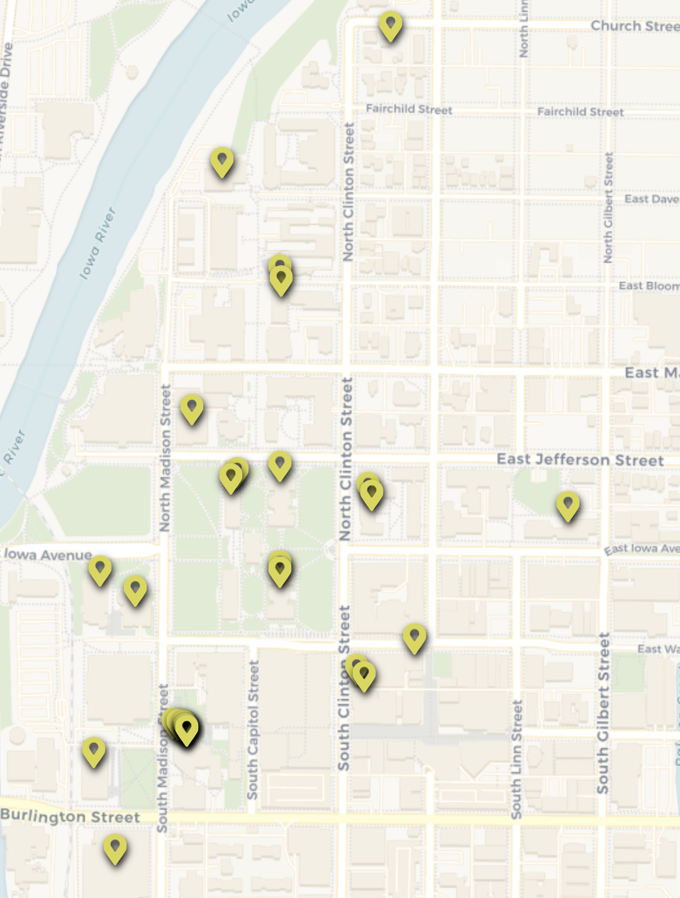

---
aliases:
  - Social Sciences
Steward_Area: 🟡 Yellow
---
%% DATAVIEW_PUBLISHER: start
| Programs                          |
| --------------------------------- |
| <ul><li>Social Sciences</li></ul> |

%%

| Programs                          |
| --------------------------------- |
| <ul><li>Social Sciences</li></ul> |

%% DATAVIEW_PUBLISHER: end %%

# Steward:
%% DATAVIEW_PUBLISHER: start
| Steward                                                         | Email                  |
| --------------------------------------------------------------- | ---------------------- |
| [Zach Demko](../../Admin/Categories/Members/Officers/Zach%20Demko.md) | demkozachary@gmail.com |

%%

| Steward                                                         | Email                  |
| --------------------------------------------------------------- | ---------------------- |
| [Zach Demko](../../Admin/Categories/Members/Officers/Zach%20Demko.md) | demkozachary@gmail.com |

%% DATAVIEW_PUBLISHER: end %%

# Departments:

%% DATAVIEW_PUBLISHER: start
- [Anthropology](../../Admin/Departments/Anthropology.md)
- [Art Museum](../../Admin/Departments/Art%20Museum.md)
- [Belin Blank Gifted Center](../../Admin/Departments/Belin%20Blank%20Gifted%20Center.md)
- [Center for Advanced Studies](../../Admin/Departments/Center%20for%20Advanced%20Studies.md)
- [Classics](../../Admin/Departments/Classics.md)
- [Communication Studies](../../Admin/Departments/Communication%20Studies.md)
- [Dance](../../Admin/Departments/Dance.md)
- [Education Policy and Leadership](../../Admin/Departments/Education%20Policy%20and%20Leadership.md)
- [Educational Administration](../../Admin/Departments/Educational%20Administration.md)
- [Evaluation and Assessment Center](../../Admin/Departments/Evaluation%20and%20Assessment%20Center.md)
- [Geography and Sustainability Sciences](../../Admin/Departments/Geography%20and%20Sustainability%20Sciences.md)
- [History](../../Admin/Departments/History.md)
- [Information Technology Services](../../Admin/Departments/Information%20Technology%20Services.md)
- [Interdisciplinary Program](../../Admin/Departments/Interdisciplinary%20Program.md)
- [Iowa Reading Research Center](../../Admin/Departments/Iowa%20Reading%20Research%20Center.md)
- [Iowa Testing Programs](../../Admin/Departments/Iowa%20Testing%20Programs.md)
- [Journalism and Mass Communications](../../Admin/Departments/Journalism%20and%20Mass%20Communications.md)
- [Labor Center](../../Admin/Departments/Labor%20Center.md)
- [Learning Resource Center](../../Admin/Departments/Learning%20Resource%20Center.md)
- [Political Science](../../Admin/Departments/Political%20Science.md)
- [Psychological and Brain Sciences](../../Admin/Departments/Psychological%20and%20Brain%20Sciences.md)
- [Psychological and Quantitative Foundations](../../Admin/Departments/Psychological%20and%20Quantitative%20Foundations.md)
- [Rehabilitation and Counselor Education](../../Admin/Departments/Rehabilitation%20and%20Counselor%20Education.md)
- [Rec Services](../../Admin/Departments/Rec%20Services.md)
- [School of Urban and Regional Affairs](../../Admin/Departments/School%20of%20Urban%20and%20Regional%20Affairs.md)
- [Sociology and Criminology](../../Admin/Departments/Sociology%20and%20Criminology.md)
- [Student Aid](../../Admin/Departments/Student%20Aid.md)
- [Teacher Leader Center](../../Admin/Departments/Teacher%20Leader%20Center.md)
- [Teaching and Learning](../../Admin/Departments/Teaching%20and%20Learning.md)
- [Teaching, Learning, and Technology](../../Admin/Departments/Teaching,%20Learning,%20and%20Technology.md)
- [World Languages, Literatures and Cultures](../../Admin/Departments/World%20Languages,%20Literatures%20and%20Cultures.md)
- [Yellow Area](Yellow%20Area.md)

%%

- [Art Museum](../../Admin/Departments/Art%20Museum.md)
- [Anthropology](../../Admin/Departments/Anthropology.md)
- [Belin Blank Gifted Center](../../Admin/Departments/Belin%20Blank%20Gifted%20Center.md)
- [Center for Advanced Studies](../../Admin/Departments/Center%20for%20Advanced%20Studies.md)
- [Communication Studies](../../Admin/Departments/Communication%20Studies.md)
- [Classics](../../Admin/Departments/Classics.md)
- [Dance](../../Admin/Departments/Dance.md)
- [Education Policy and Leadership](../../Admin/Departments/Education%20Policy%20and%20Leadership.md)
- [Educational Administration](../../Admin/Departments/Educational%20Administration.md)
- [Evaluation and Assessment Center](../../Admin/Departments/Evaluation%20and%20Assessment%20Center.md)
- [History](../../Admin/Departments/History.md)
- [Geography and Sustainability Sciences](../../Admin/Departments/Geography%20and%20Sustainability%20Sciences.md)
- [Information Technology Services](../../Admin/Departments/Information%20Technology%20Services.md)
- [Interdisciplinary Program](../../Admin/Departments/Interdisciplinary%20Program.md)
- [Iowa Reading Research Center](../../Admin/Departments/Iowa%20Reading%20Research%20Center.md)
- [Journalism and Mass Communications](../../Admin/Departments/Journalism%20and%20Mass%20Communications.md)
- [Learning Resource Center](../../Admin/Departments/Learning%20Resource%20Center.md)
- [Iowa Testing Programs](../../Admin/Departments/Iowa%20Testing%20Programs.md)
- [Labor Center](../../Admin/Departments/Labor%20Center.md)
- [Political Science](../../Admin/Departments/Political%20Science.md)
- [Psychological and Brain Sciences](../../Admin/Departments/Psychological%20and%20Brain%20Sciences.md)
- [Psychological and Quantitative Foundations](../../Admin/Departments/Psychological%20and%20Quantitative%20Foundations.md)
- [Rehabilitation and Counselor Education](../../Admin/Departments/Rehabilitation%20and%20Counselor%20Education.md)
- [Rec Services](../../Admin/Departments/Rec%20Services.md)
- [Sociology and Criminology](../../Admin/Departments/Sociology%20and%20Criminology.md)
- [School of Urban and Regional Affairs](../../Admin/Departments/School%20of%20Urban%20and%20Regional%20Affairs.md)
- [Teacher Leader Center](../../Admin/Departments/Teacher%20Leader%20Center.md)
- [Teaching and Learning](../../Admin/Departments/Teaching%20and%20Learning.md)
- [Student Aid](../../Admin/Departments/Student%20Aid.md)
- [Teaching, Learning, and Technology](../../Admin/Departments/Teaching,%20Learning,%20and%20Technology.md)
- [World Languages, Literatures and Cultures](../../Admin/Departments/World%20Languages,%20Literatures%20and%20Cultures.md)
- [Yellow Area](Yellow%20Area.md)

%% DATAVIEW_PUBLISHER: end %%

# Map:
