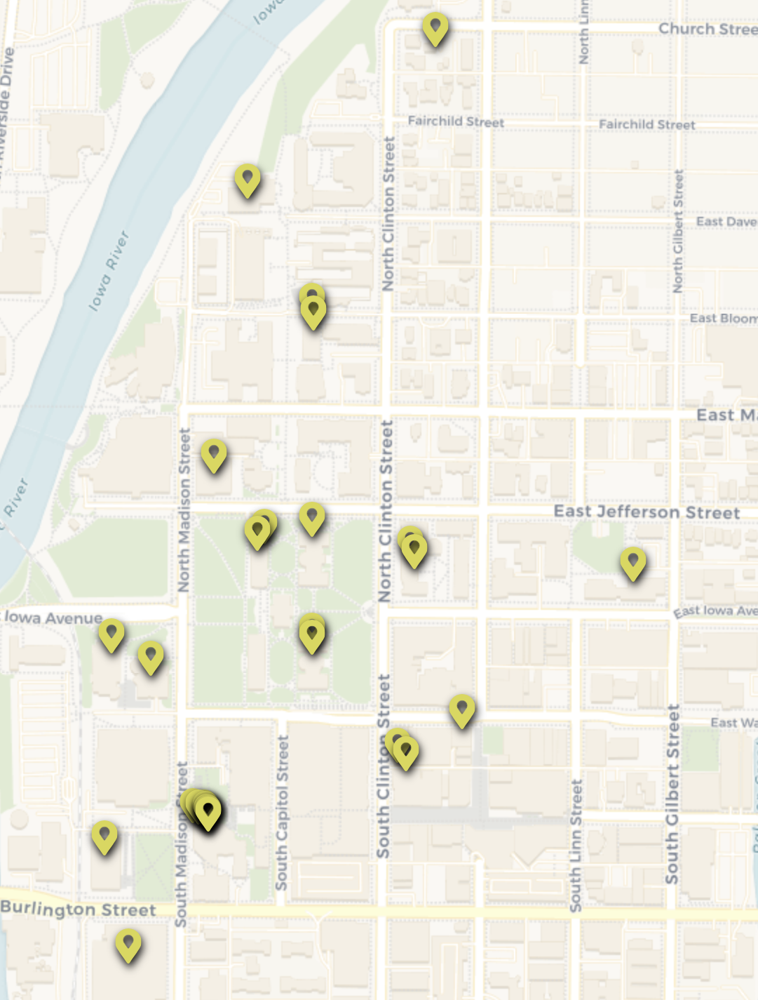

---
aliases:
  - Social Sciences
Steward_Area: 🟡 Yellow
---
%% DATAVIEW_PUBLISHER: start
| Programs                          |
| --------------------------------- |
| <ul><li>Social Sciences</li></ul> |

%%

| Programs                          |
| --------------------------------- |
| <ul><li>Social Sciences</li></ul> |

%% DATAVIEW_PUBLISHER: end %%

# Steward:
%% DATAVIEW_PUBLISHER: start
| Steward                                                         | Email                  |
| --------------------------------------------------------------- | ---------------------- |
| [Zach Demko](./Zach%20Demko.md) | demkozachary@gmail.com |

%%

| Steward                                                         | Email                  |
| --------------------------------------------------------------- | ---------------------- |
| [Zach Demko](./Zach%20Demko.md) | demkozachary@gmail.com |

%% DATAVIEW_PUBLISHER: end %%

# Departments:

%% DATAVIEW_PUBLISHER: start
- [Anthropology](./Anthropology.md)
- [Art Museum](./Art%20Museum.md)
- [Belin Blank Gifted Center](./Belin%20Blank%20Gifted%20Center.md)
- [Center for Advanced Studies](./Center%20for%20Advanced%20Studies.md)
- [Classics](./Classics.md)
- [Communication Studies](./Communication%20Studies.md)
- [Dance](./Dance.md)
- [Education Policy and Leadership](./Education%20Policy%20and%20Leadership.md)
- [Educational Administration](./Educational%20Administration.md)
- [Evaluation and Assessment Center](./Evaluation%20and%20Assessment%20Center.md)
- [Geography and Sustainability Sciences](./Geography%20and%20Sustainability%20Sciences.md)
- [History](./History.md)
- [Information Technology Services](./Information%20Technology%20Services.md)
- [Interdisciplinary Program](./Interdisciplinary%20Program.md)
- [Iowa Reading Research Center](./Iowa%20Reading%20Research%20Center.md)
- [Iowa Testing Programs](./Iowa%20Testing%20Programs.md)
- [Journalism and Mass Communications](./Journalism%20and%20Mass%20Communications.md)
- [Labor Center](./Labor%20Center.md)
- [Learning Resource Center](./Learning%20Resource%20Center.md)
- [Political Science](./Political%20Science.md)
- [Psychological and Brain Sciences](./Psychological%20and%20Brain%20Sciences.md)
- [Psychological and Quantitative Foundations](./Psychological%20and%20Quantitative%20Foundations.md)
- [Rec Services](./Rec%20Services.md)
- [Rehabilitation and Counselor Education](./Rehabilitation%20and%20Counselor%20Education.md)
- [School of Urban and Regional Affairs](./School%20of%20Urban%20and%20Regional%20Affairs.md)
- [Sociology and Criminology](./Sociology%20and%20Criminology.md)
- [Student Aid](./Student%20Aid.md)
- [Teaching and Learning](./Teaching%20and%20Learning.md)
- [Teacher Leader Center](./Teacher%20Leader%20Center.md)
- [Teaching, Learning, and Technology](./Teaching,%20Learning,%20and%20Technology.md)
- [World Languages, Literatures and Cultures](./World%20Languages,%20Literatures%20and%20Cultures.md)
- [Yellow Area](Yellow%20Area.md)

%%

- [Art Museum](./Art%20Museum.md)
- [Anthropology](./Anthropology.md)
- [Belin Blank Gifted Center](./Belin%20Blank%20Gifted%20Center.md)
- [Center for Advanced Studies](./Center%20for%20Advanced%20Studies.md)
- [Communication Studies](./Communication%20Studies.md)
- [Classics](./Classics.md)
- [Dance](./Dance.md)
- [Education Policy and Leadership](./Education%20Policy%20and%20Leadership.md)
- [Educational Administration](./Educational%20Administration.md)
- [Evaluation and Assessment Center](./Evaluation%20and%20Assessment%20Center.md)
- [History](./History.md)
- [Geography and Sustainability Sciences](./Geography%20and%20Sustainability%20Sciences.md)
- [Information Technology Services](./Information%20Technology%20Services.md)
- [Interdisciplinary Program](./Interdisciplinary%20Program.md)
- [Iowa Reading Research Center](./Iowa%20Reading%20Research%20Center.md)
- [Journalism and Mass Communications](./Journalism%20and%20Mass%20Communications.md)
- [Learning Resource Center](./Learning%20Resource%20Center.md)
- [Iowa Testing Programs](./Iowa%20Testing%20Programs.md)
- [Labor Center](./Labor%20Center.md)
- [Political Science](./Political%20Science.md)
- [Psychological and Brain Sciences](./Psychological%20and%20Brain%20Sciences.md)
- [Psychological and Quantitative Foundations](./Psychological%20and%20Quantitative%20Foundations.md)
- [Rehabilitation and Counselor Education](./Rehabilitation%20and%20Counselor%20Education.md)
- [Rec Services](./Rec%20Services.md)
- [Sociology and Criminology](./Sociology%20and%20Criminology.md)
- [School of Urban and Regional Affairs](./School%20of%20Urban%20and%20Regional%20Affairs.md)
- [Teacher Leader Center](./Teacher%20Leader%20Center.md)
- [Teaching and Learning](./Teaching%20and%20Learning.md)
- [Student Aid](./Student%20Aid.md)
- [Teaching, Learning, and Technology](./Teaching,%20Learning,%20and%20Technology.md)
- [World Languages, Literatures and Cultures](./World%20Languages,%20Literatures%20and%20Cultures.md)
- [Yellow Area](Yellow%20Area.md)

%% DATAVIEW_PUBLISHER: end %%

# Map:
